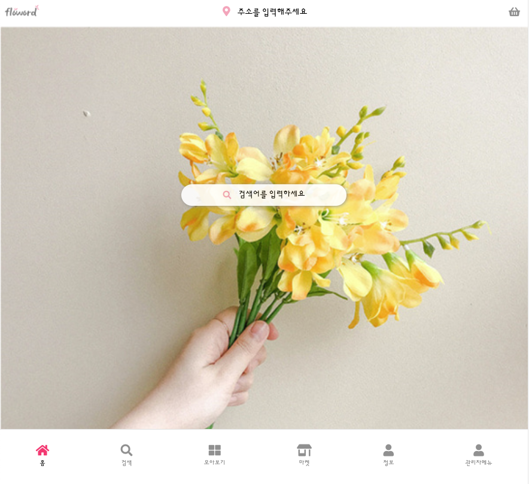
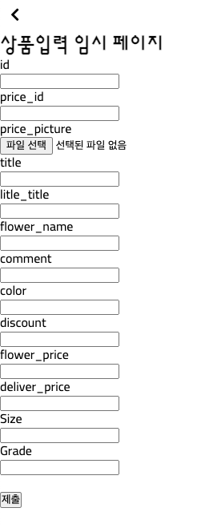
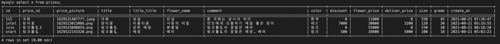
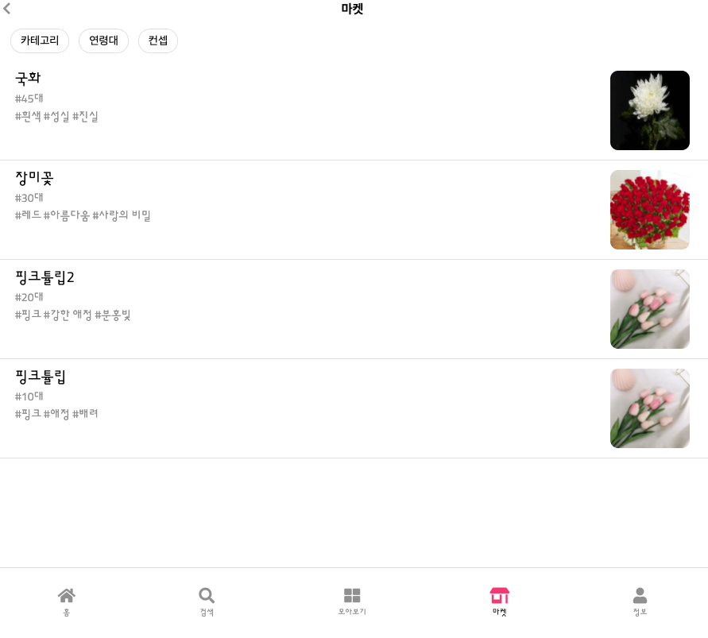
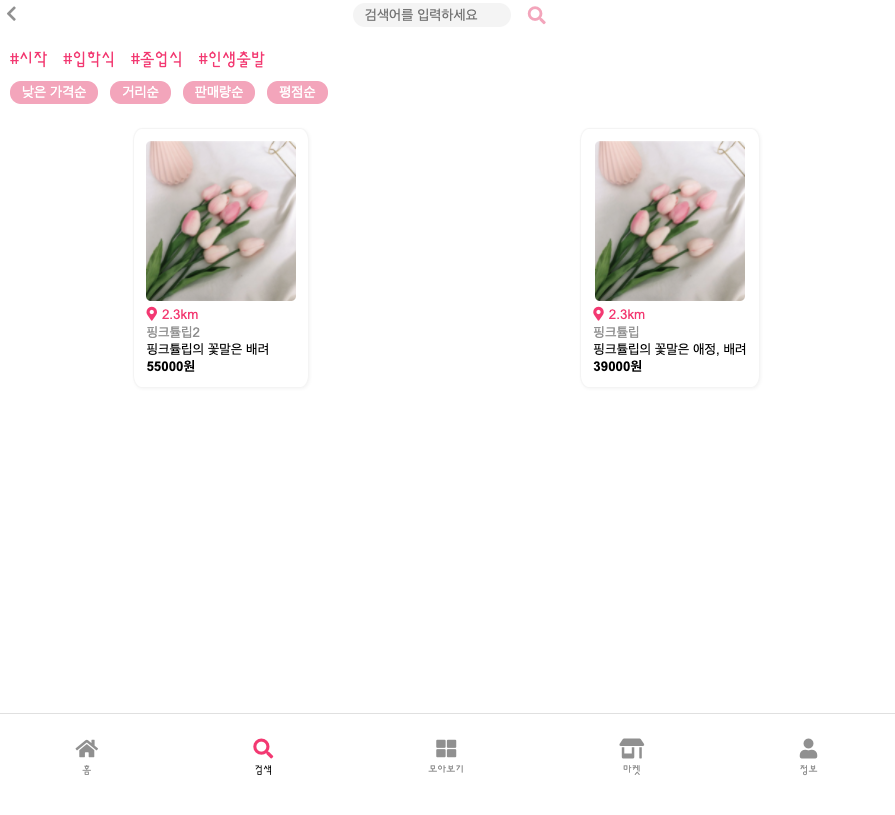

# pina_backend

## ~8.21(토) 업데이트 내용
    html -> ejs file 변경 (database로부터 파일 읽기)
    sequelize 문법을 사용한 mysql databases table
    database : pina_db
    table : models 내에 존재하는 table (address, comment, index, mypage, prize, search, user)
### 1. __admin menu__ : prize table에 정보를 입력할 수 있습니다.

</img>
</img>

> 초기 홈페이지에서 관리자메뉴에 들어갈 수 있습니다.

> 꽃 사진(price_picture)에 대한 이미지는 public/pictures에 저장됩니다.

> 입력된 prize 데이터는 __마켓__ 을 통해 확인가능하며, __검색(title)__ 을 통해서 원하는 데이터를 추출 할 수 있습니다.

 
 

### 2. __마켓__ : prize 테이블에 모든 데이터들을 나열합니다.

> 카테고리, 연령대, 컨셉 등 세부메뉴는 구현되지 않았습니다.

 
 

### 3. __검색__ : 검색시 search 테이블에 데이터가 입력되며, 검색한 데이터들 중 prize 테이블에 title과 일치하는 값들을 불러옵니다.

> 검색실패 기능 구현하지 않았습니다.

> 검색한 데이터들의 id 값은 현재 임의의 id값을 넣었습니다.

### 4. __상품 확인__ : prize 테이블에 있는 데이터들의 세부내용을 product_info 페이지에 ?flower=prize.id> 쿼리를 통하여 접속하여 확인할 수 있습니다.

> prize의 정보중 일부분만 넣었습니다.
